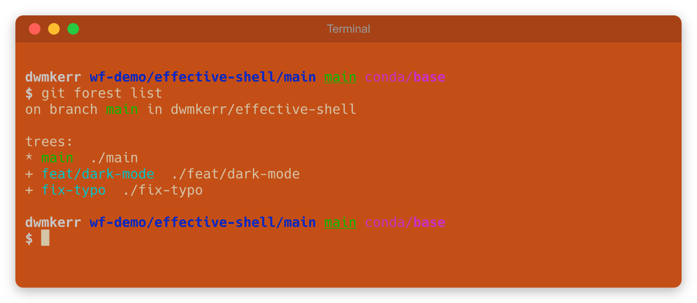
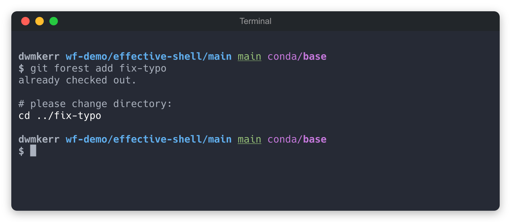
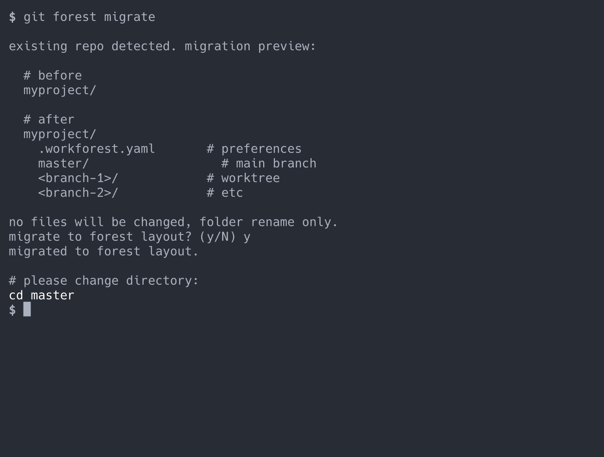
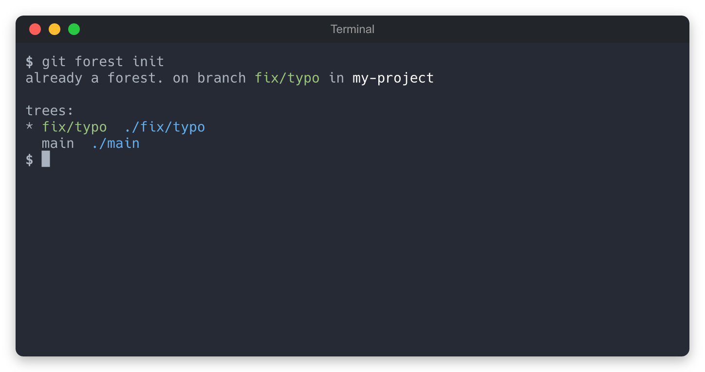

<p align="center">
  <h2 align="center"><code>🌲 git-workforest</code></h2>
  <h3 align="center">Manage git worktrees with a simple, predictable folder structure.<br/>Like <code>git worktree</code>, but handles paths for you.</h3>
  <p align="center">
    <a href="https://www.npmjs.com/package/@dwmkerr/git-workforest"></a>
    <a href="https://codecov.io/gh/dwmkerr/git-workforest"></a>
    <a href="https://github.com/dwmkerr/git-workforest/actions/workflows/skill-tests.yaml"></a>
  </p>
  <p align="center">
    <a href="#quickstart">Quickstart</a> |
    <a href="#commands">Commands</a> |
    <a href="#configuration">Configuration</a>
  </p>
</p>

<p align="center">
  
</p>

## Quickstart

Install:

```bash
npm install -g @dwmkerr/git-workforest
```

```bash
# Run init from anywhere — it detects your context and suggests what to do.
git forest init

# Migrate an existing repo to forest layout.
cd ~/repos/effective-shell
git forest migrate
# ~/repos/effective-shell/ is now:
#   .workforest.yaml
#   main/                   <- you are here

# Or clone a repo into a new forest.
git forest clone dwmkerr/effective-shell
# ~/repos/github/dwmkerr/effective-shell/
#   .workforest.yaml
#   main/

# List all trees.
git forest list

# Add a tree for a branch.
git forest add fix-typo
# ~/repos/github/dwmkerr/effective-shell/
#   .workforest.yaml
#   main/
#   fix-typo/               <- new tree

# Remove a tree.
git forest remove fix-typo
```

Commands mirror `git worktree` semantics — `list`, `add`, `remove` — but workforest handles paths automatically. You can also use the aliases `git-workforest` or `workforest`.

## Worktree folder structure

Each branch gets its own folder inside the forest:

```
# Main location for your repos (see Configuration to customise)
~/repos/github/dwmkerr/effective-shell/
  .workforest.yaml        # config file
  main/                   # default branch (worktree)
  fix/typo/               # feature branch (worktree)
  big-refactor/           # another branch
```

Branches are created as git worktrees by default, so they share the same `.git` data. See [`fatTrees`](#configuration) if you need full clones<sup>1</sup>.

## Global flags

| Flag | Description |
|------|-------------|
| `-v, --verbose` | Print each git command and its output (dimmed) — useful for diagnosing unexpected behaviour |

```bash
git forest -v add fix-typo
# $ git worktree add ../fix-typo fix-typo
# added fix-typo.
```

You can also enable verbose mode permanently via the [config file](#configuration) (`verbose: true`).

## Commands

### `git forest list`

List all trees in the forest. Highlights the active branch when run from inside a tree.

```bash
# like: git worktree list
git forest list
# on branch main in dwmkerr/effective-shell
#
# trees:
# * main            ./main
# + feat/dark-mode  ./feat/dark-mode
# + fix-typo        ./fix-typo
```


### `git forest add <branch>`

Add a tree for a branch — finds an existing tree or creates a new worktree.

```bash
# like: git worktree add ../big-refactor big-refactor
git forest add big-refactor
# added big-refactor.
#
# effective-shell/
#   main/
#   fix-typo/
#   big-refactor/       <- new tree
```



### `git forest remove <branch>`

Remove a tree from the forest. Refuses if the tree has uncommitted changes (use `-f` to force).

```bash
# like: git worktree remove ../fix-typo
git forest remove fix-typo
# removed fix-typo.
#
# effective-shell/
#   main/
#   big-refactor/

# force remove even if dirty
git forest remove -f big-refactor
```

### `git forest clone <org/repo>`

Clone a GitHub repo into a new forest. Shows the proposed location and asks for confirmation. Use `-y` to skip the prompt.

```bash
git forest clone dwmkerr/effective-shell
# clone dwmkerr/effective-shell to ~/repos/github/dwmkerr/effective-shell? (Y/n)
#
# effective-shell/
#   .workforest.yaml
#   main/
```

### `git forest migrate`

Migrate an existing repo to forest layout. Shows a before/after preview with your real local branches, asks for confirmation, then moves your repo contents into a branch subfolder.



### `git forest init`

Detect your context and do the right thing — show trees if already a forest, offer to migrate if inside a repo, or suggest cloning if empty.



## Configuration

Customise behaviour in `~/.workforest.yaml`:

```yaml
reposDir: "~/repos/[provider]/[org]/[repo]"
treeDir: "[branch]"
fatTrees: false
verbose: false
```

| Parameter | Default | Description |
|-----------|---------|-------------|
| `reposDir` | `~/repos/[provider]/[org]/[repo]` | Path template for cloned repos. Tokens: `[provider]`, `[org]`, `[repo]` |
| `treeDir` | `[branch]` | Subdirectory name for each tree. Token: `[branch]` |
| `fatTrees` | `false` | Use full clones instead of git worktrees (see below) |
| `verbose` | `false` | Print each git command and its output — same as passing `-v` on every command |

<sup>1</sup> **Fat trees**: With worktrees, git prevents checking out a branch that's already checked out elsewhere. If you need to freely switch branches across trees, set `fatTrees: true` to use independent full clones instead.

## Claude Code plugin

This repo is a Claude Code plugin. Install it to teach Claude how to work with workforest-managed repositories:

```bash
claude plugin add dwmkerr/git-workforest
```

This adds a `workforest` skill that helps Claude understand forest layouts, use `git forest` commands, and navigate between trees.

## Developer guide

Clone and install:

```bash
git clone git@github.com:dwmkerr/git-workforest.git
cd git-workforest
npm install
```

Build and test:

```bash
make build
make test
```

Install globally:

```bash
make install
```

## License

MIT
