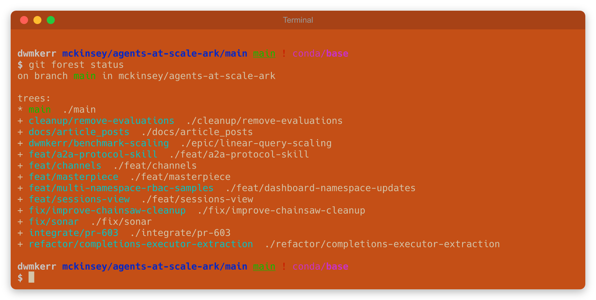
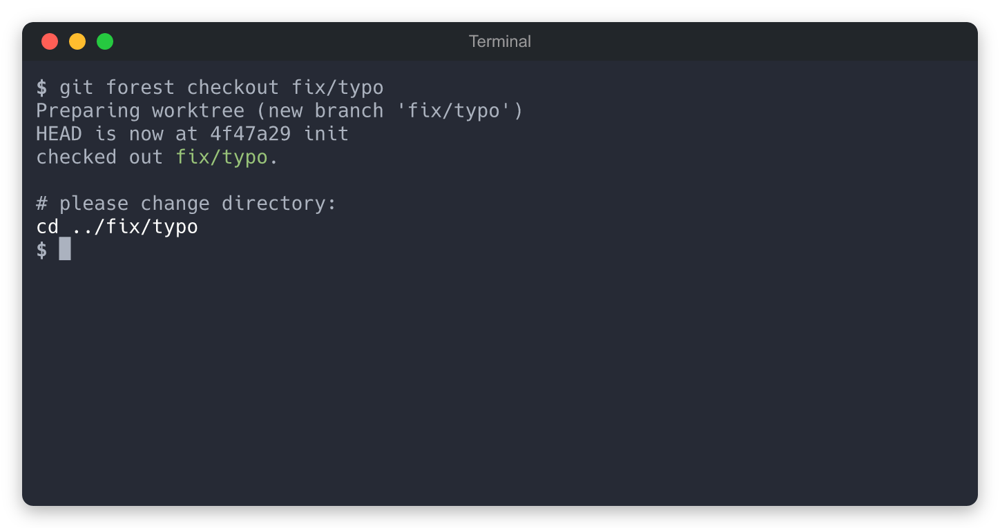

<p align="center">
  <h2 align="center"><code>🌲 git-workforest</code></h2>
  <h3 align="center">Git worktrees organised into a simple and predictable folder structure.<br/>Use <code>git forest</code> commands to quickly clone, checkout and switch between branches.</h3>
  <p align="center">
    <a href="https://www.npmjs.com/package/workforest"></a>
    <a href="https://codecov.io/gh/dwmkerr/git-workforest"></a>
    <a href="https://github.com/dwmkerr/git-workforest/actions/workflows/skill-tests.yaml"></a>
  </p>
  <p align="center">
    <a href="#quickstart">Quickstart</a> |
    <a href="#commands">Commands</a> |
    <a href="#configuration">Configuration</a>
  </p>
</p>

<p align="center">
  
</p>

## Quickstart

Install:

```bash
npm install -g @dwmkerr/git-workforest
```

Run `git forest init` from anywhere. If you are in a repo it'll show the worktrees and offer to migrate to the workforest structure if needed. If you are not in a repo then `git forest init` will show how to clone.

```bash
# Move to a repo.
cd ~/repos/effective-shell

# Migrate to the workforest folder structure...
git forest init

# ...or just clone an existing repo.
git forest clone dwmkerr/git-workforest
```

You can also use the aliases `git-workforest` or `workforest`. As much as possible the structure existing `git` commands is followed, for example `git forest checkout` will checkout or create a branch as needed.

## Worktree folder structure

Each branch gets its own folder inside the forest:

```
# Main location for your repos (see Configuration to customise)
~/repos/github/dwmkerr/effective-shell/
  .workforest.yaml        # config file
  main/                   # default branch (worktree)
  fix/typo/               # feature branch (worktree)
  big-refactor/           # another branch
```

Branches are created as git worktrees by default, so they share the same `.git` data. See [`fatTrees`](#configuration) if you need full clones<sup>1</sup>.

## Commands

### `git forest clone <org/repo>`

Clone a GitHub repo into the structured forest path. Shows the proposed location and asks for confirmation. Use `-y` to skip the prompt.

```bash
git forest clone dwmkerr/effective-shell
# clone dwmkerr/effective-shell to ~/repos/github/dwmkerr/effective-shell? (Y/n)
```

### `git forest migrate`

Migrate an existing repo to forest layout. Shows a before/after preview with your real local branches, asks for confirmation, then moves your repo contents into a branch subfolder.


### `git forest checkout <branch>`

Check out a branch — finds an existing tree or creates a new worktree. Also available as `git forest tree`.



### `git forest status`

Show all trees in the current forest. Highlights the active branch when run from inside a tree.


### `git forest init`

Detect your context and do the right thing — show status if already a forest, offer to migrate if inside a repo, or suggest cloning if empty.


## Configuration

Create `~/.workforest.yaml` to customise behaviour:

```yaml
reposDir: "~/repos/[provider]/[org]/[repo]"
treeDir: "[branch]"
fatTrees: false
```

| Parameter | Default | Description |
|-----------|---------|-------------|
| `reposDir` | `~/repos/[provider]/[org]/[repo]` | Path template for cloned repos. Tokens: `[provider]`, `[org]`, `[repo]` |
| `treeDir` | `[branch]` | Subdirectory name for each tree. Token: `[branch]` |
| `fatTrees` | `false` | Use full clones instead of git worktrees (see below) |

<sup>1</sup> **Fat trees**: With worktrees, git prevents checking out a branch that's already checked out elsewhere. If you need to freely switch branches across trees, set `fatTrees: true` to use independent full clones instead.

## Claude Code plugin

This repo is a Claude Code plugin. Install it to teach Claude how to work with workforest-managed repositories:

```bash
claude plugin add dwmkerr/git-workforest
```

This adds a `workforest` skill that helps Claude understand forest layouts, use `git forest` commands, and navigate between trees.

## Developer guide

Clone and install:

```bash
git clone git@github.com:dwmkerr/git-workforest.git
cd git-workforest
npm install
```

Build and test:

```bash
make build
make test
```

Install globally:

```bash
make install
```

## License

MIT
